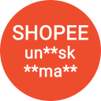
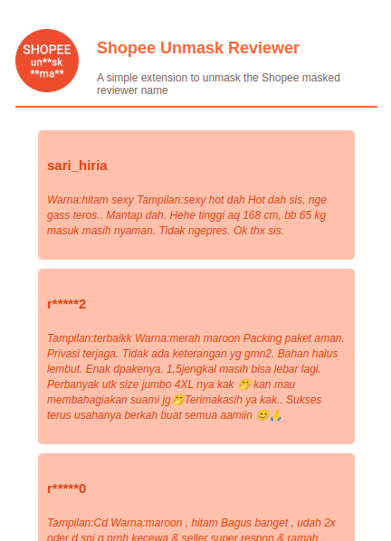

## Shopee Unmask Reviewer

A simple chrome browser extension to unmask the masked username of shopee reviewer.

Supported shopee domains:

- https://shopee.co.id
- https://shopee.tw
- https://shopee.cn
- https://shopee.com.my
- https://shopee.ph
- https://shopee.com.br
- https://shopee.co.th

### Installation

Simply clone the repository or download the .zip file, then add it to a Chromium-based browser. Enable Developer Mode in the Extensions Manager and install it as an unpacked extension.

> This extension has been tested on the Brave browser.

### Usage

Just open the extension once you're on the Shopee product page. You will see the reviewers and their comments listed in the extension popup. Clicking on a particular item will display a popup with the selected reviewer's profile informations.

### Schreenshot

